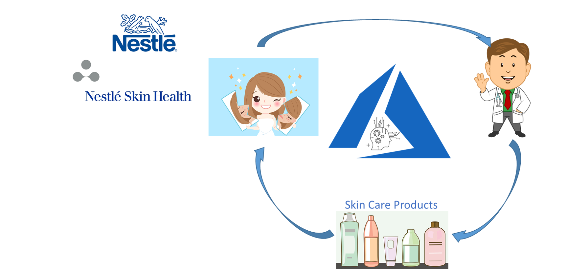

# Spatially Robust Deep Learning Application for Assessing the Facial Acne Severity Using Selfie Images

Microsoft collaborates with Nestlé Skin Health SHIELD (Skin Health, Innovation, Education, and Longevity Development, NSH) to develop a mobile app powered by deep learning models. 

There are two main functions of the mobile app: 
1) assess the acne severity of users based on uploaded selfie images as accurately as a dermatologist. 
2) recommend treatment plans appropriate to the specific level of severity of the user’s acne and  skin care products with the additional demographic information such as gender, age, skin type, etc.  

It allows Nestlé Skin Health to actively engage with their customers, make dermatological expertise user-friendly and accessible at the palms of hands, and address their customers’ needs promptly (as shown in the following Figure). This application significantly shortens the feedback loop for their products with real-time customer data, thus enabling the company to proactively design new or improve existing products.

Here is the Decoded Show for this work:

# Getting Started

Nestlé Skin Health (NSH) provides 4700 selfie images for this work, labeled in five categories: 1-Clear, 2-Almost Clear, 3-Mild, 4-Moderate, 5-Severe. 

There are a few challenges in this work:

1) insufficient training data: The number of selfie images (=4700) is small to train a deep learning model from scrach.
2) poor quality of images and labels: some selfile images are with bad environment control and human labels from dermatolgists are noisy. 

To tackle these challenges:

1)	We propose a novel image augmentation approach for face images which addresses the spatial sensitivity problem of CNN models on small training data. It significantly improves the generality of the model on testing images. 
2) We convert the classification problem to a regression model by assigning ordinary numerical values to the five acne severity levels.

In the end, we build a real-world skin management mobile application including the whole cycle of dermatologists, users, skin care products. 

# Step by step instructions

[data_processing_demo.ipynb](notebooks/data_processing_demo.ipynb) is the easiest way to check our proposed image augmentation approach. It shows both extracting skin patch and rolling approach on the demo image. As the acne images in this work cannot be shared, an [image](data/demo_images/Barack-Obama-Wallpaper.jpg) from Bing Image is provided for demo.

[Step1_Data_RemoveNoise.ipynb](notebooks/Step1_Data_RemoveNoise.ipynb) shows the code for extracting skin patches using acne images

[Step2_Data_Augmentation.ipynb](notebooks/Step2_Data_Augmentation.ipynb) goes deeper in rolling approach considering the number of rolling times for each class of acne images. 

[Step3_Training_Pipeline.ipynb](notebooks/Step3_Training_Pipeline.ipynb) shows how to apply transfer learning and train the fullly connected neural network on acne dataset.

[Step4_Scoring_Pipeline.ipynb](notebooks/Step4_Scoring_Pipeline.ipynb) is used to score test images

[Step5_Deployment_Pipeline.ipynb](notebooks/Step5_Deployment_Pipeline.ipynb) with supporting python files ([getPatches.py](notebooks/getPatches.py), [model.py](notebooks/model.py), [regressionModel.py](regressionModel.py)) shows how to deploy the model to Azure. 
